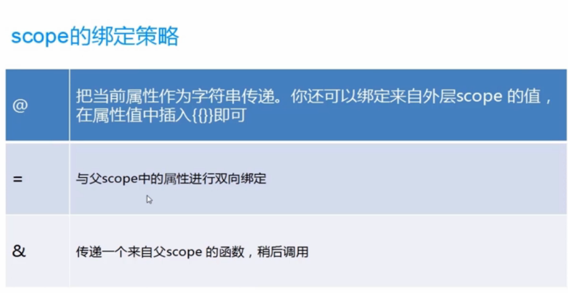
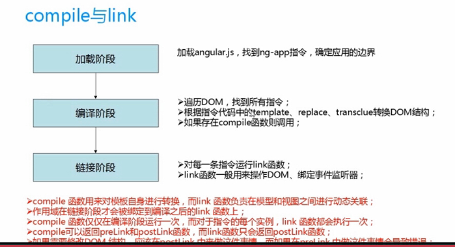
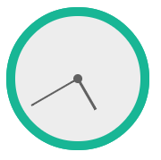

canvas-clock-by-angular-directive
==========

#知识点: canvas + angular directive

##canvas 
- 基本绘图函数API
    
    - `translate()`
    - `rotate()`
    - `save()` and `restore()`
    - ......
- canvas始终是基于`状态`的渲染，`状态`包括当前的线条属性，颜色，路径等。也就是说如果没有指定的状态更新，最后一个状态进行`stroke()` 和 `fill()`类的函数会覆盖以前的效果。


## angurlar directive 
- 自定义指令的各个属性

```javascript

    clockApp.directive('clock', function(){
        // Runs during compile
        return {
            // name: '',
            // priority: 1,
            // terminal: true,
            // scope: {}, // {} = isolate, true = child, false/undefined = no change
            // controller: function($scope, $element, $attrs, $transclude) {},
            // require: 'ngModel', // Array = multiple requires, ? = optional, ^ = check parent elements
            restrict: 'A', // E = Element, A = Attribute, C = Class, M = Comment
            // template: '<canvas id="canvas"></canvas>',
            // templateUrl: '',
            // replace: true
            // transclude: true,
            // compile: function(tElement, tAttrs, function transclude(function(scope, cloneLinkingFn){ return function linking(scope, elm, attrs){}})),
            link: function(scope, element ) {
                element.width = 160;
                element.height = 160;
                console.log(element);
                var context = element[0].getContext("2d");
                setInterval(drwaClock,1000);
                function drwaClock(){
                   //drwa clock here
                };
            }
        };
    }); 


```

附上一张自定义指令中scope的三中绑定策略 


- angular加载的过程



理清了自定指令的基本属性配置，在`link`里面进行dom 操作进行canvas 的绘画就水到渠成了：


